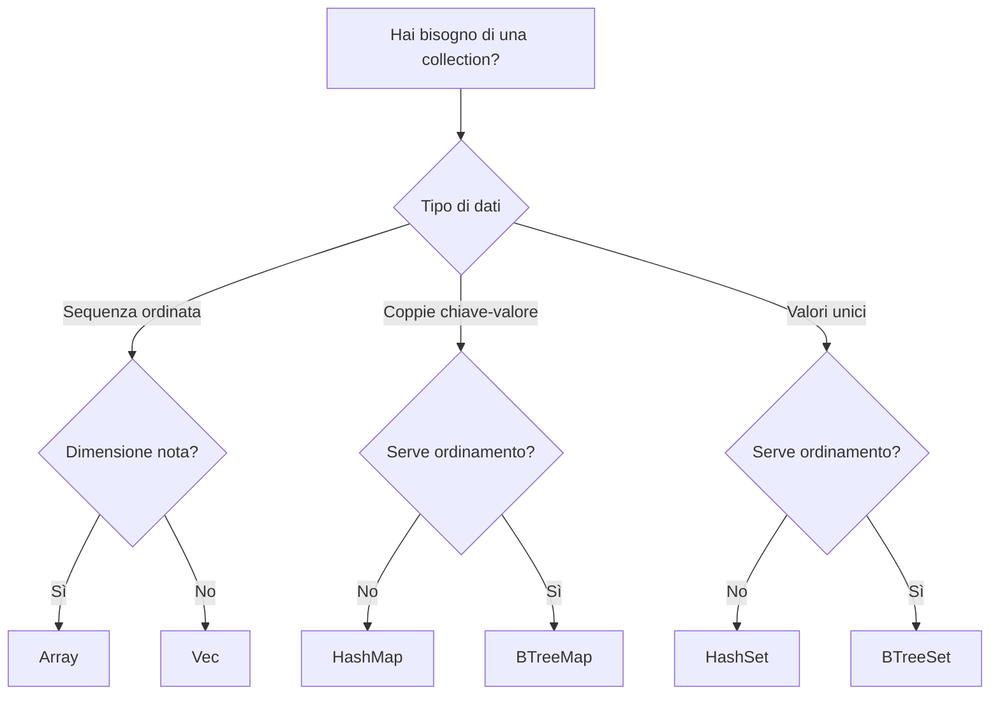

# Collections

!!! info "Riferimento originale"
    📖 [Documentazione originale](https://doc.rust-lang.org/std/collections/)
    🔄 Traduzione in corso
    📝 Versione Rust: 1.90+

Le **collections** di Rust sono strutture dati che possono contenere valori multipli. A differenza degli array, i dati delle collection sono allocati sullo heap, il che significa che la quantità di dati non deve essere nota a compile-time e può crescere o ridursi durante l'esecuzione del programma.

---

## 📚 Collections Disponibili

### ✅ Tradotte

- **[Vec\<T\>](vec.md)** - Array dinamico ridimensionabile
  - Crescita/riduzione dinamica
  - Accesso per indice O(1)
  - Push/pop O(1) ammortizzato
  - [Vai alla documentazione →](vec.md)

- **[HashMap\<K, V\>](hashmap.md)** - Mappa hash per coppie chiave-valore
  - Accesso O(1) medio
  - Inserimento/rimozione O(1) medio
  - Entry API per manipolazioni efficienti
  - [Vai alla documentazione →](hashmap.md)

- **[HashSet\<T\>](hashset.md)** - Set basato su hash per valori unici
  - Accesso O(1) medio
  - Operazioni su insiemi (unione, intersezione, differenza)
  - Implementato come HashMap\<T, ()\>
  - [Vai alla documentazione →](hashset.md)

### 📅 Prossimamente

Le seguenti collections verranno tradotte prossimamente:

#### BTreeMap\<K, V\>

Mappa ordinata basata su B-tree con accesso O(log n).

🔗 [Documentazione ufficiale (EN)](https://doc.rust-lang.org/std/collections/struct.BTreeMap.html)

#### BTreeSet\<T\>

Set ordinato basato su B-tree con accesso O(log n).

🔗 [Documentazione ufficiale (EN)](https://doc.rust-lang.org/std/collections/struct.BTreeSet.html)

#### VecDeque\<T\>

Coda double-ended per inserimento/rimozione efficiente da entrambi i lati.

🔗 [Documentazione ufficiale (EN)](https://doc.rust-lang.org/std/collections/struct.VecDeque.html)

#### LinkedList\<T\>

Lista doppiamente concatenata (raramente usata, preferire Vec o VecDeque).

🔗 [Documentazione ufficiale (EN)](https://doc.rust-lang.org/std/collections/struct.LinkedList.html)

#### BinaryHeap\<T\>

Heap binario (coda di priorità).

🔗 [Documentazione ufficiale (EN)](https://doc.rust-lang.org/std/collections/struct.BinaryHeap.html)

---

## 🎯 Quale Collection Usare?

### Guida Rapida



### Usa Vec quando

- ✅ Vuoi una sequenza di elementi
- ✅ Serve accesso per indice
- ✅ Aggiungi/rimuovi principalmente alla fine
- ✅ È la collection più comune (usa questa di default)

### Usa HashMap quando

- ✅ Vuoi associare chiavi a valori
- ✅ Serve accesso veloce per chiave
- ✅ L'ordine non è importante

### Usa HashSet quando

- ✅ Vuoi memorizzare valori unici
- ✅ Serve verificare se un elemento esiste
- ✅ L'ordine non è importante

### Usa BTreeMap/BTreeSet quando

- ✅ Serve iterare in ordine ordinato
- ✅ Serve trovare il min/max efficiente
- ✅ Serve range query

### Usa VecDeque quando

- ✅ Inserisci/rimuovi da entrambi i lati
- ✅ Implementi una coda o stack

---

### Performance

Per scegliere la collection giusta, è necessario comprendere i punti di forza di ciascuna di esse. Di seguito riassumiamo brevemente le prestazioni delle diverse collection per alcune operazioni importanti. Per ulteriori dettagli, consultare la documentazione relativa a ciascun tipo e tenere presente che i nomi dei metodi effettivi potrebbero differire da quelli riportati nelle tabelle sottostanti per alcune collection.

In tutta la documentazione, ci atterremo alle seguenti convenzioni per la notazione delle operazioni:

- La dimensione della collection è indicata con n.
- Se è coinvolta una seconda collection, la sua dimensione è indicata con m.
- Gli indici degli elementi sono indicati con i.
- Le operazioni che hanno un costo ammortizzato sono contrassegnate dal suffisso *.
- Le operazioni con un costo previsto sono contrassegnate dal suffisso ~.

La chiamata di operazioni che aggiungono elementi a una collection richiederà occasionalmente il ridimensionamento di essa, un'operazione aggiuntiva che richiede un tempo O(n).

I costi ammortizzati sono calcolati per tenere conto del costo in termini di tempo di tali operazioni di ridimensionamento su una serie sufficientemente ampia di operazioni. Una singola operazione può essere più lenta o più veloce a causa della natura sporadica del ridimensionamento della collection, tuttavia il costo medio per operazione si avvicinerà al costo ammortizzato.

Le raccolte di Rust non si riducono mai automaticamente, quindi le operazioni di rimozione non sono ammortizzate.
HashMap utilizza i costi previsti. È teoricamente possibile, anche se molto improbabile, che HashMap abbia prestazioni significativamente peggiori rispetto al costo previsto. Ciò è dovuto alla natura probabilistica dell'hashing, ovvero è possibile generare un hash duplicato dato un determinato input chiave che richiederà un calcolo aggiuntivo per essere corretto.

#### Costo delle operazioni riassunto

| Struttura     | get(i)           | insert(i)              | remove(i)              | append(Vec(m)) | split_off(i)        | range        | append     |
|----------------|------------------|-------------------------|------------------------|----------------|---------------------|--------------|-------------|
| **Vec**        | O(1)             | O(n−i)\*               | O(n−i)                 | O(m)\*         | O(n−i)              | N/A          | N/A         |
| **VecDeque**   | O(1)             | O(min(i, n−i))\*       | O(min(i, n−i))         | O(m)\*         | O(min(i, n−i))      | N/A          | N/A         |
| **LinkedList** | O(min(i, n−i))   | O(min(i, n−i))         | O(min(i, n−i))         | O(1)           | O(min(i, n−i))      | N/A          | N/A         |
| **HashMap**    | O(1)~            | O(1)~\*                | O(1)~                  | N/A            | N/A                 | N/A          | N/A         |
| **BTreeMap**   | O(log n)         | O(log n)               | O(log n)               | N/A            | N/A                 | O(log n)     | O(n+m)      |

!!! note
    Si noti che in caso di parità, Vec sarà generalmente più veloce di VecDeque, mentre VecDeque sarà generalmente più veloce di LinkedList.
    Per gli insiemi, tutte le operazioni hanno lo stesso costo delle operazioni equivalenti su Map.

#### Utilizzo corretto ed efficiente delle collection

Naturalmente, sapere quale collection è quella giusta per il lavoro non ti permette immediatamente di implementarla correttamente. Ecco alcuni suggerimenti rapidi per un uso efficiente e corretto delle collection standard. Se sei interessato a come utilizzarne una specifica in particolare, consulta la relativa documentazione per una discussione dettagliata ed esempi di codice.

#### Gestione della capacità (Capacity Management)

Molte collection forniscono diversi costruttori e metodi che fanno riferimento alla "capacità". Queste raccolte sono generalmente costruite su un array. Idealmente, questo array dovrebbe avere esattamente le dimensioni giuste per contenere solo gli elementi memorizzati nella collection, ma sarebbe molto inefficiente. Se l'array di supporto avesse sempre le dimensioni giuste, ogni volta che viene inserito un elemento, la collection dovrebbe aumentare le dimensioni dell'array per contenerlo. A causa del modo in cui la memoria viene allocata e gestita sulla maggior parte dei computer, ciò richiederebbe quasi certamente l'allocazione di un array completamente nuovo e la copia di ogni singolo elemento da quello vecchio a quello nuovo. È facile intuire che ciò non sarebbe molto efficiente da fare ad ogni operazione.

La maggior parte delle collection utilizza quindi una strategia di allocazione ammortizzata. In genere si lasciano una discreta quantità di spazio libero in modo da dover crescere solo occasionalmente. Quando crescono, allocano un array sostanzialmente più grande in cui spostare gli elementi, in modo che ci voglia un po' di tempo prima che sia necessaria un'altra crescita. Sebbene questa strategia sia ottima in generale, sarebbe ancora meglio se la raccolta non dovesse mai ridimensionare il proprio array di supporto. Sfortunatamente, la collection stessa non dispone di informazioni sufficienti per farlo autonomamente. Pertanto, spetta a noi programmatori fornirle dei suggerimenti.

Qualsiasi costruttore ***with_capacity*** indicherà alla collection di allocare spazio sufficiente per il numero specificato di elementi. Idealmente questo sarà esattamente per quel numero di elementi, ma alcuni dettagli di implementazione potrebbero impedirlo. Per ulteriori dettagli, consultare la documentazione specifica della collection. In generale, utilizzare ***with_capacity*** quando si conosce esattamente il numero di elementi che verranno inseriti, o almeno si dispone di un limite massimo ragionevole per quel numero.

Quando si prevede un grande afflusso di elementi, è possibile utilizzare la famiglia di metodi reserve per indicare alla collezione quanto spazio deve riservare per gli elementi in arrivo. Come per ***with_capacity***, il comportamento preciso di questi metodi sarà specifico per la collection di interesse.

Per ottenere prestazioni ottimali, le collezioni generalmente evitano di ridursi. Se si ritiene che una collection non conterrà presto altri elementi, o semplicemente si ha davvero bisogno della memoria, il metodo ***shrink_to_fit*** richiede alla collection di ridurre l'array di supporto alla dimensione minima in grado di contenere i suoi elementi.

Infine, se si è interessati alla capacità effettiva della collection, la maggior parte delle collection fornisce un metodo capacity per richiedere queste informazioni su richiesta. Ciò può essere utile per scopi di debug o per l'uso con i metodi ***reserve***.

### Iterators

Gli iteratori (**iterators**) sono un meccanismo potente e robusto utilizzato in tutte le librerie standard di Rust. Gli iteratori forniscono una sequenza di valori in modo generico, sicuro, efficiente e conveniente. Il contenuto di un iteratore viene solitamente valutato in modo pigro, in modo che vengano prodotti solo i valori effettivamente necessari e non sia necessario allocare memoria per memorizzarli temporaneamente. Gli iterator vengono utilizzati principalmente con un ciclo for, anche se molte funzioni accettano iterators quando è richiesta una raccolta o una sequenza di valori.

Tutte le collezioni standard forniscono diversi iteratori per eseguire la manipolazione in blocco dei loro contenuti. I tre iteratori principali che quasi tutte le collezioni dovrebbero fornire sono:

- iter
- iter_mut
- into_iter

Alcuni di questi non sono forniti nelle collezioni in cui sarebbe poco sicuro o irragionevole fornirli.

**iter** fornisce un iteratore di riferimenti immutabili a tutti i contenuti di una collezione nell'ordine più “naturale”. Per le raccolte di sequenze come Vec, ciò significa che gli elementi saranno restituiti in ordine crescente di indice a partire da 0. Per le raccolte ordinate come BTreeMap, ciò significa che gli elementi saranno restituiti in ordine ordinato. Per le raccolte non ordinate come HashMap, gli elementi saranno restituiti nell'ordine più conveniente per la rappresentazione interna. Ciò è ottimo per leggere tutti i contenuti della raccolta.

```rust
let vec = vec![1, 2, 3, 4];
for x in vec.iter() {
   println!("vec contained {x:?}");
}
```

**iter_mut** fornisce un iteratore di riferimenti mutabili nello stesso ordine di iter. Questo è ottimo per modificare tutti i contenuti della collezione.

```rust
let mut vec = vec![1, 2, 3, 4];
for x in vec.iter_mut() {
   *x += 1;
}
```

**into_iter** trasforma la collezione effettiva in un iteratore sul suo contenuto per valore. Ciò è utile quando la collezione stessa non è più necessaria e i valori sono richiesti altrove. L'uso di extend con into_iter è il modo principale per spostare il contenuto di una collezione in un'altra. extend chiama automaticamente into_iter e accetta qualsiasi T: IntoIterator. Anche chiamare collect su un iteratore stesso è un ottimo modo per convertire una collezione in un'altra. Entrambi questi metodi dovrebbero utilizzare internamente gli strumenti di gestione della capacità discussi nella sezione precedente per farlo nel modo più efficiente possibile.

```rust
let mut vec1 = vec![1, 2, 3, 4];
let vec2 = vec![10, 20, 30, 40];
vec1.extend(vec2);

use std::collections::VecDeque;

let vec = [1, 2, 3, 4];
let buf: VecDeque<_> = vec.into_iter().collect();

```

Gli iteratori forniscono anche una serie di metodi adattatori per eseguire operazioni comuni sulle sequenze. Tra gli adattatori vi sono quelli funzionali più utilizzati, come **map**, **fold**, **skip** e **take**. Di particolare interesse per le collezioni è l'adattatore **rev**, che inverte qualsiasi iteratore che supporti questa operazione. La maggior parte delle collezioni fornisce iteratori reversibili come metodo per iterare su di esse in ordine inverso.

```rust
let vec = vec![1, 2, 3, 4];
for x in vec.iter().rev() {
   println!("vec contained {x:?}");
}
```

Diversi altri metodi di raccolta restituiscono anch'essi iteratori per produrre una sequenza di risultati, ma evitano di allocare un'intera raccolta per memorizzare il risultato. Ciò garantisce la massima flessibilità, poiché è possibile richiamare collect o extend per “convogliare” la sequenza in qualsiasi raccolta, se lo si desidera. In alternativa, è possibile eseguire un ciclo sulla sequenza con un ciclo for. L'iteratore può anche essere scartato dopo un uso parziale, evitando il calcolo degli elementi non utilizzati.

### Entries

L'API entry ha lo scopo di fornire un meccanismo efficiente per manipolare i contenuti di una mappa(**map**) in base alla presenza o meno di una chiave. Il principale caso d'uso è quello di fornire mappe accumulatori efficienti. Ad esempio, se si desidera mantenere un conteggio del numero di volte in cui ogni chiave è stata vista, sarà necessario eseguire una logica condizionale per verificare se questa è la prima volta che la chiave viene vista o meno. Normalmente, ciò richiederebbe una ricerca (**find**) seguita da un inserimento (**insert**), duplicando di fatto lo sforzo di ricerca ad ogni inserimento.

Quando un utente chiama **map.entry(key)**, la mappa cercherà la chiave e poi restituirà una variante dell'enumerazione **Entry**.

Se viene restituito un **Vacant(entry)**, significa che la chiave non è stata trovata. In questo caso l'unica operazione valida è inserire un valore nella voce. Una volta fatto ciò, la voce vacante viene consumata e convertita in un riferimento mutabile al valore che è stato inserito. Ciò consente un'ulteriore manipolazione del valore oltre la durata della ricerca stessa. Ciò è utile se è necessario eseguire una logica complessa sul valore indipendentemente dal fatto che il valore sia stato appena inserito.

Se viene restituito un **Occupied(entry)**, significa che la chiave è stata trovata. In questo caso, l'utente ha diverse opzioni: può ottenere, inserire o rimuovere il valore della voce occupata. Inoltre, può convertire la voce occupata in un riferimento mutabile al suo valore, fornendo simmetria al caso di inserimento vacante.

### Esempi

Ecco i due modi principali in cui viene utilizzato **entry**. Di seguito è riportato un semplice esempio in cui la logica eseguita sui valori è banale.

#### Contare il numero di volte in cui ogni carattere compare in una stringa

```rust
use std::collections::btree_map::BTreeMap;

let mut count = BTreeMap::new();
let message = "she sells sea shells by the sea shore";

for c in message.chars() {
    *count.entry(c).or_insert(0) += 1;
}

assert_eq!(count.get(&'s'), Some(&8));

println!("Number of occurrences of each character");
for (char, count) in &count {
    println!("{char}: {count}");
}
```

Quando la logica da eseguire sul valore è più complessa, possiamo semplicemente utilizzare l'entry API per garantire che il valore sia inizializzato ed eseguire la logica in un secondo momento.

#### Monitoraggio dello stato di ebbrezza dei clienti in un bar

```rust
use std::collections::btree_map::BTreeMap;

// A client of the bar. They have a blood alcohol level.
struct Person { blood_alcohol: f32 }

// All the orders made to the bar, by client ID.
let orders = vec![1, 2, 1, 2, 3, 4, 1, 2, 2, 3, 4, 1, 1, 1];

// Our clients.
let mut blood_alcohol = BTreeMap::new();

for id in orders {
    // If this is the first time we've seen this customer, initialize them
    // with no blood alcohol. Otherwise, just retrieve them.
    let person = blood_alcohol.entry(id).or_insert(Person { blood_alcohol: 0.0 });

    // Reduce their blood alcohol level. It takes time to order and drink a beer!
    person.blood_alcohol *= 0.9;

    // Check if they're sober enough to have another beer.
    if person.blood_alcohol > 0.3 {
        // Too drunk... for now.
        println!("Sorry {id}, I have to cut you off");
    } else {
        // Have another!
        person.blood_alcohol += 0.1;
    }
}
```

#### Insert and complex keys

Se abbiamo una chiave più complessa, le chiamate per l'inserimento (**insert**) non aggiorneranno il valore della chiave. Ad esempio:

```rust
use std::cmp::Ordering;
use std::collections::BTreeMap;
use std::hash::{Hash, Hasher};

#[derive(Debug)]
struct Foo {
    a: u32,
    b: &'static str,
}

// we will compare `Foo`s by their `a` value only.
impl PartialEq for Foo {
    fn eq(&self, other: &Self) -> bool { self.a == other.a }
}

impl Eq for Foo {}

// we will hash `Foo`s by their `a` value only.
impl Hash for Foo {
    fn hash<H: Hasher>(&self, h: &mut H) { self.a.hash(h); }
}

impl PartialOrd for Foo {
    fn partial_cmp(&self, other: &Self) -> Option<Ordering> { self.a.partial_cmp(&other.a) }
}

impl Ord for Foo {
    fn cmp(&self, other: &Self) -> Ordering { self.a.cmp(&other.a) }
}

let mut map = BTreeMap::new();
map.insert(Foo { a: 1, b: "baz" }, 99);

// We already have a Foo with an a of 1, so this will be updating the value.
map.insert(Foo { a: 1, b: "xyz" }, 100);

// The value has been updated...
assert_eq!(map.values().next().unwrap(), &100);

// ...but the key hasn't changed. b is still "baz", not "xyz".
assert_eq!(map.keys().next().unwrap().b, "baz");
```

---

## 🤝 Vuoi Contribuire?

Vuoi aiutarci a tradurre altre collections (BTreeMap, BTreeSet, VecDeque, ecc.)?

[**Inizia a contribuire →**](../../CONTRIBUTING.md){ .md-button .md-button--primary }

---

## 📖 Risorse Aggiuntive

### Altre Sezioni Tradotte

- [String](../string/string.md) - Stringhe UTF-8 allocate su heap (spesso usate insieme alle collections)
- [Tipi Primitivi](../primitives.md) - Tipi base di Rust inclusi array e slice

### Documentazione Ufficiale (Inglese)

- [Collections Module](https://doc.rust-lang.org/std/collections/)
- [The Book - Collections](https://doc.rust-lang.org/book/ch08-00-common-collections.html)
- [Rust by Example - Vec](https://doc.rust-lang.org/rust-by-example/std/vec.html)

### Performance

- [std::collections Performance](https://doc.rust-lang.org/std/collections/#performance)
- [Big-O Cheat Sheet](https://www.bigocheatsheet.com/)

---

**Ultima revisione**: Ottobre 2025
**Versione Rust**: 1.90+

*Documentazione originale © The Rust Project Developers | Traduzione © Rust Italia Community*
